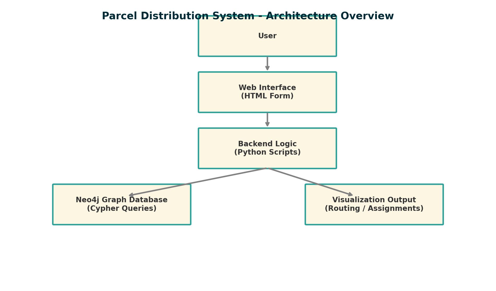

# 📦 Graph-Based Delivery Optimizer using Neo4j

This project implements a graph-based system to optimize delivery routes using Neo4j. It supports CSV-based data import, shortest path planning, and live-state filtering via a modular Python backend.

---

## ✅ Features

- 📦 Source → Transport → Destination logistics model
- 📈 K-shortest path algorithm via Neo4j GDS
- 🚫 State-based node filtering (e.g., idle vs busy)
- 🧠 Memory estimation before GDS query execution
- 🔌 Java-compatible backend with modular Python interface
- 📊 Multi-file and single-file CSV ingestion supported
- 🖼 Visualized real-time topology of graph network

---

## 🛠 Tech Stack

| Component     | Technology             |
|---------------|------------------------|
| Language       | Python, Java           |
| Database       | Neo4j 5.11.0           |
| Algorithms     | Neo4j GDS (Yen's KSP)  |
| Data Format    | CSV + Cypher Script    |
| Libraries      | py2neo, prettytable    |

---

## 📁 Project Structure

```
neo4j_delivery_optimizer/
├── README.md
├── data/
│   ├── source_node.csv
│   ├── transport.csv
│   ├── desti.csv
│   ├── source_transport.csv
│   ├── transport_transport.csv
│   ├── transport_destination.csv
│   ├── device_data.csv
├── scripts/
│   ├── import_script
│   ├── import_cypher_script
├── src/
│   ├── graph_path_algorithm.py
│   ├── device_graph_algorithm.py
│   ├── case_graph_algorithm.py
│   ├── neo4j_connector.py
├── img/
│   ├── test_graph.png
│   ├── parcel_system_architecture.png
```

---

## 📸 Example Topology Diagram



---

## 🚀 How to Run

1. Install Neo4j and start a local instance.
2. Place `.csv` files in the Neo4j import directory.
3. Run scripts from `scripts/` in Neo4j Browser to import data.
4. Use Python modules in `src/` to compute routes, filter nodes, or export paths.

---

## 👨‍💻 Author Contribution (Frida YuZhao)

- Frontend + basic HTML interface
- Designed data schema and graph structure in Neo4j
- Built Python-based shortest path module
- Integrated Cypher automation for import and queries

---

## 📚 Academic Reference

Built as part of COMP SCI 7015 SEP, University of Adelaide, Group: PATH_10_PG
